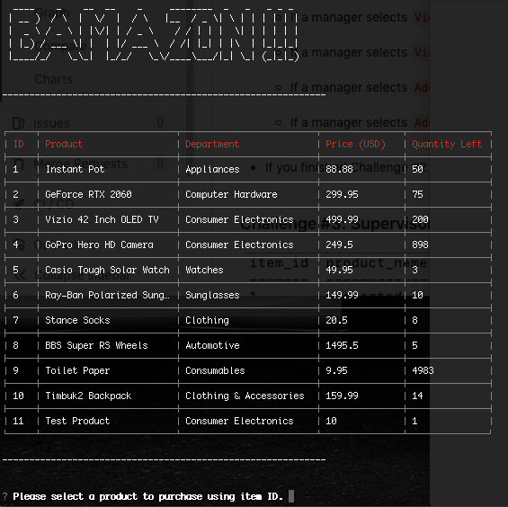
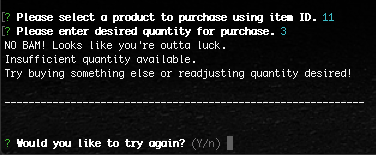
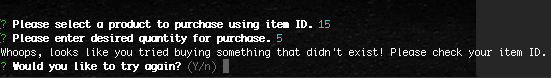
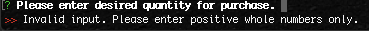
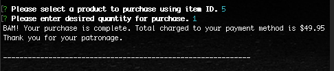
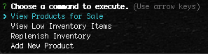
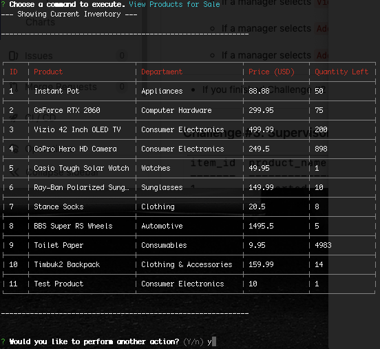
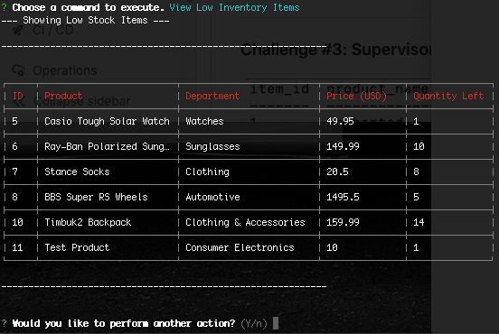
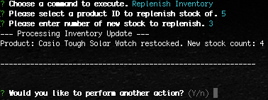
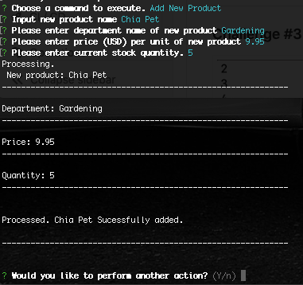

# HW10 BAMAZON APP

## Installation 
* npm-install for initial download of dependent packages

### Usage
* node bamazonManager.js --> run Manager Control Panel application
* node bamazonCustomer.js --> run Customer Item Purchase application

### Customer App Screenshots
* Initial prompt - displays current inventory status and allows purchase of items by ID number.

* Edge case 1 - attempt to purchase items out of stock or more than quantity available.

* Edge case 2 - invalid item ID.

* Edge case 3 - invalid quantity input.

* Successful purchase screen

### Manager App Screenshots
* Initial prompt - displays manager options.

* View Products - shows current inventory

* View Low Stock Products - shows low stock items.

* Replenish Stock - Add quantity to product by ID.

* Add new product - create new product and specify attributes.

* Edge cases include negative/non whole number inputs for quantity, price, etc.

### Technologies Used
* Node.JS 
* MySQL
* Inquirer
* figlet
* CLI-Table
* Javascript ES6

### Comments
* Added edge cases for invalid inputs
* figlet utilized for ASCII art generation
* CLI-Table leveraged for clean formatting of product tables
